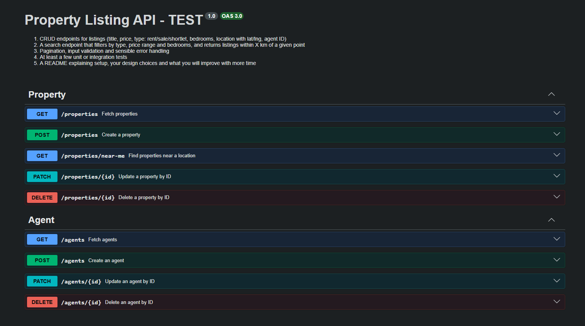

# Property Listing API (Test)



A REST API for property listings, built with **NestJS** and **PostgreSQL** (Drizzle ORM).
Clients can perform CRUD on **properties** and **agents**, list properties with pagination and
filters, and find properties **near a coordinate** — sorted by distance using **PostGIS**.

Interactive API docs (Swagger UI) are served at `/docs` once the app is running.

---

## Table of contents

- [Overview](#overview)
- [Tech stack](#tech-stack)
- [Requirements](#requirements)
- [Getting started](#getting-started)
- [Environment variables](#environment-variables)
- [API reference](#api-reference)
- [Testing](#testing)
- [Project structure](#project-structure)
- [Design decisions](#design-decisions)
- [What I'd improve with more time](#what-id-improve-with-more-time)

---

## Overview

The API is split into two feature modules that follow the same layered shape:

- **`property`** — the main resource. Properties have a title, price, type
  (`rent` | `sale` | `shortlet` | `bedrooms` | `villa`), description, bedrooms, a
  `{ latitude, longitude }` location, an availability flag and a reference to the agent that
  lists them.
- **`agent`** — the agent that owns/listings a property (`name`, `email`, `phone`).

Every list endpoint is paginated and returns the same envelope:

```json
{
  "page": 1,
  "pageSize": 10,
  "total": 42,
  "data": [ /* ... */ ]
}
```

Properties are returned with their agent nested, so a single request is enough to render a listing.

---

## Tech stack
- Language - TypeScript (ESM, `nodenext`)  
- HTTP Layer - NestJS 12(Express adapter)
- ORM - Drizzle ORM
- Database - PostgreSQL
- Geospatial - PostGIS 
- Validation - class-validator   
- API documentation - OpenAPI 3 via nest/swagger                    
- Unit Tests  - Vitest via nestjs/testing
                             

---

## Requirements

- **Node.js 20+** or **Bun**
- **PostgreSQL 14+** with the **PostGIS** extension enabled (required by the near-me/distance search)

---

## Getting started

### 1. Clone the repository

```bash
git clone https://github.com/emekadefirst/property-listing-api-test.git
cd property-listing-api-test
```

### 2. Install dependencies

```bash
npm install
# or
bun install
```

### 3. Configure the environment

Create a `.env` file in the project root (see [Environment variables](#environment-variables)):

```bash
cp .env.example .env   # if you keep an .env.example
```

### 4. Set up the database

Make sure a PostgreSQL server is running and that PostGIS is available (the `postgis/postgis`
image used by `docker-compose.yml` already includes it):

```sql
CREATE EXTENSION IF NOT EXISTS postgis;   -- needed for the near-me search
```

Then push the Drizzle schema to the database:

```bash
# Apply the schema directly (great for local development)
bunx drizzle-kit push

# ...or generate SQL migrations and run them
bunx drizzle-kit generate
bunx drizzle-kit migrate
```

### 5. Run the app

```bash
# Development (watch mode)
bun run dev

# Production
bun run build
bun run start
```

The API listens on `http://localhost:3000` (configurable via `APP_PORT`), and Swagger UI is at
**http://localhost:3000/docs**.

### Database with Docker (alternative)

If you don't want to run PostgreSQL locally, `docker-compose.yml` starts just a PostGIS-enabled
database — run the API on your host against it:

```bash
cp .env.example .env       # set DB_* / APP_PORT
docker compose up -d       # PostgreSQL + PostGIS on ${DB_PORT}
bunx drizzle-kit push      # apply the schema (or generate + migrate)
bun run dev
```

The API connects to `localhost:${DB_PORT}`. (A `Dockerfile` is included if you'd rather
containerise the API as well.)

---

## API reference

Base URL: `http://localhost:3000`. Interactive docs: **`GET /docs`**.


### Error handling

Errors are returned by a single `AppError` hierarchy (`src/error/index.ts`) with a status code and
a message, e.g. `400` for validation failures (via the global `ValidationPipe`) and `404`/`500` for
the repository errors.

---

## Testing

Tests use **Vitest** and mock the service layer, so they run without a database.

```bash
bun run test         # single run
bun run test:watch   # watch mode
bun run test:cov     # coverage
```


## Design decisions

- **Layered per module** — `models → dtos → types → repository → service → controller`, plus a
  dedicated `docs` file per module so Swagger metadata stays out of the controllers.
- **DTOs drive both validation and docs.** The same DTO class powers `class-validator` and the
  OpenAPI schema via a global `ValidationPipe` (`transform: true`, `whitelist: true`). Query-string
  numbers are coerced with `@Type(() => Number)`, and every optional query param uses
  `@ApiPropertyOptional` so it isn't documented as required.
- **Distance is computed in SQL with PostGIS.** Coordinates are stored as JSON; the near-me search
  builds a point and uses `ST_DistanceSphere`, returning the distance in kilometres and sorting by it.
- **Consistent pagination envelope** (`page`, `pageSize`, `total`, `data`) across every list endpoint.
- **Timestamps are serialized to ISO strings** at the repository boundary so responses are JSON-ready
  and documented consistently.
- **Centralised errors** (`AppError` + subclasses) keep controllers/services free of HTTP details.

### How PostGIS powers `GET /properties/near-me`

Coordinates are stored in a plain JSON column  rather
than a geometry column, so PostGIS does the work at query time instead of at write time.

- The stored JSON coordinates are read with  and cast to float, the origin is bound as a single
text parameter, and both are parsed as SRID `4326` points. 
- ST_DistanceSphere  is
the right tool for lat/lng on WGS84: it measures on a spherical earth model and returns **metres**, so
the / 1000 converts to kilometres.

- The query is ordered by that distance and every row comes
back with distance rounded to two decimals in km. And with our the lat and log params it's ordered by createdAt

The endpoint sorts by distance but applies no radius cutoff — every property is returned, nearest
first.

---

## What I'd improve with more time

- I'll implement middlewares to
  - Identify The client App via x-api-key in the header,
  - Implement a Redis powered ratelimit middleware
- I'll also modularize the Docker files used into a single docker folder to keep the project clean.
- I'll implement a session based authentication, add a password field to the agent table and hash before storing it using argon.
- I'll also write a module that generate presign link for the client app to a blob storage  to store files like Property images views and even Agent Profile image and also write these files urls to the db
- I'll add a radius distance filter to GET /properties/near-me, so it can return only the
  listings within X km instead of every property sorted by distance.


